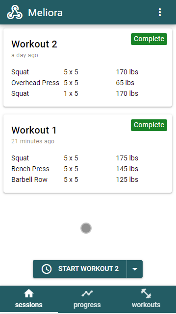
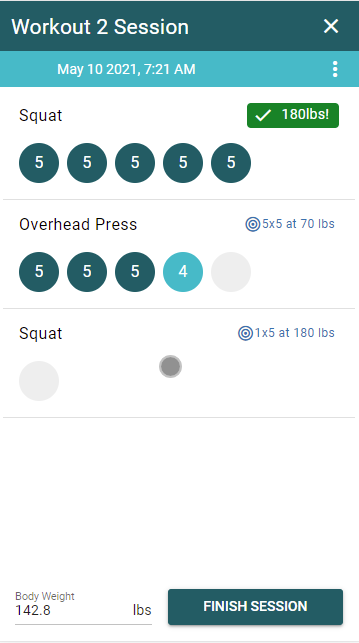
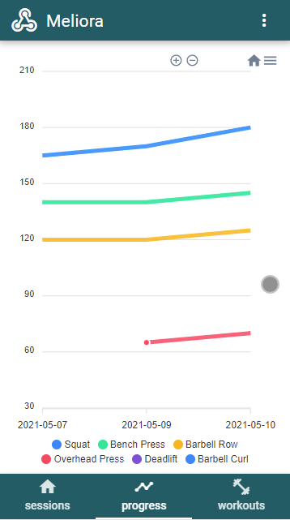
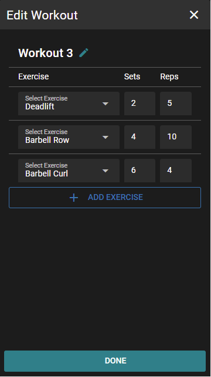

# Meliora

A mobile workout app built with VueJS, VuexORM and Quasar. The app loosely follows the 5x5 workout program found [here](https://stronglifts.com/5x5/) but allows for more user customizations.

Right now the App is in on going development with an expected beta release on Android in the near future.

## Beta Features
* Customized Workouts
* Visual Progress Tracker
* Dark Mode

## General Release Features
* Session History
* Session Notes
* Workout Types
  * Currently the app targets resistance training but support for cardio/yoga and other exercise types will be supported as well.
* Account Persistance (Optional)

## Future Roadmap
* Sharing workouts
* Friends
* Tracking progress against friends
